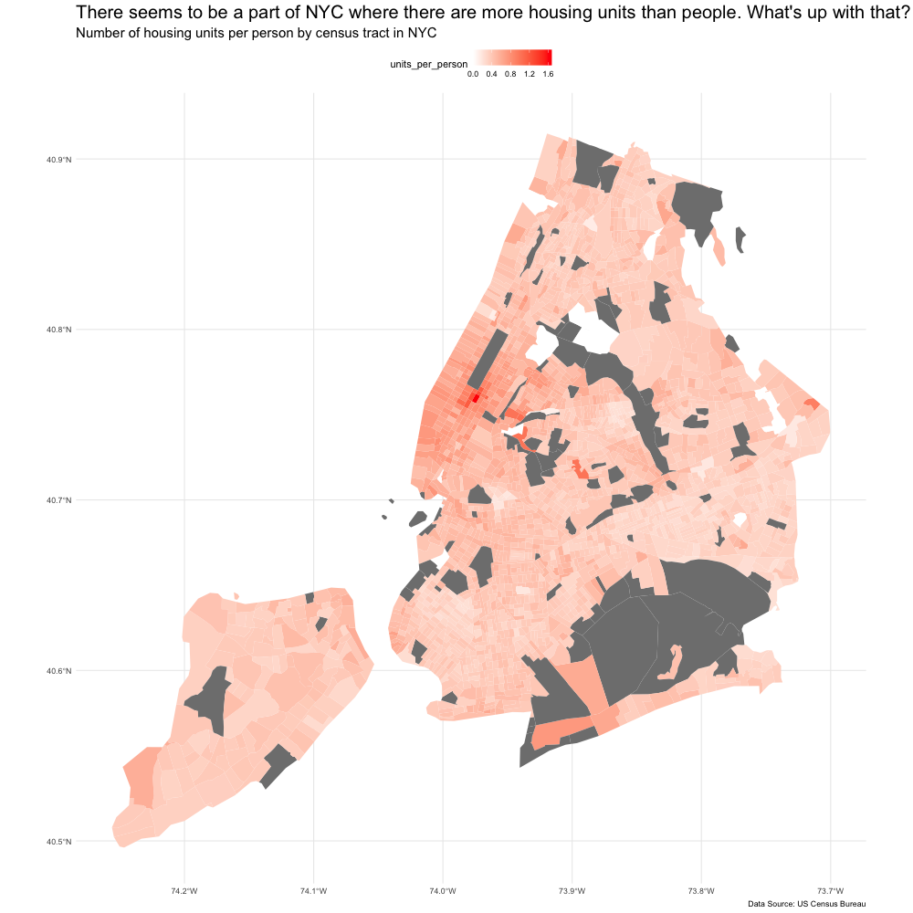

# What's Up With That?

In this assignment you will do some exploratory data analysis using Census data. The goal is to come up with an observation or a question (not a story) by just exploring data. It doesn't have to be a story, or even a pitch. Just a well articulated question that makes you go "huh, what's up with that?".

## Part 1: Study the code (with ChatGPT's help)

Study the code in `tidycensus-example.ipynb` and understand what it does. If you need to talk to ChatGPT as you study the code, please do so. Feel free to tinker with the code (modify the geography, change out the variables, etc). You'll be asked to submit your transcript with ChatGPT as you tried to understand the code and make changes.

- What not to do in part 1: 🚫 Just run the code and move on to part 2
- What to do in part 1: ✅ Read the code, try to understand it, talk to ChatGPT (or ask in slack) about what you don't understand

## Part 2: Exploratory data analysis

In this assignment you will do some exploratory data analysis using Census data. You will see that I have already done some in `example-question.ipynb`. This notebook is quite similar to the previous one, but you'll notice some differences in **step 2** where I have selected different variables and **step 5** where I have mutated the data to create a new variable that I wanted to analyze. You will use the `your-question.ipynb` notebook, but you can refer back to the example notebooks or use ChatGPT for help.

The goal is to explore the data until you come up with a question or an observation that you'd be interested in evaluating further. The headline of the chart will be the question or observation. Note that this is not a reader-facing chart, so you don't need to make the headline particularly short or catchy. Think of it as a note to your editor, to a colleague, or to your future self.

The subheadline will be exactly what the chart is so that anyone looking at the chart without the code or data can decipher what it is about.

Your chart doesn't have to be a map. It can be histograms, dotplots, scatterplots, anything. If you need more than one chart to ask your question, feel free to do that. Here's where I landed. This isn't necessarily a story, just an observation or a question.

## Submission

Your submission will include:

1. a link to your GitHub repo
2. a link (or links) to your conversation with ChatGPT in part 2
3. a google doc where you ask the "What's up with that" question (make sure to share it with Dhrumil and Aishi). It can contain the chart alone if you have a good headline and subheadline or a few sentences in addition to the chart or charts to give it some context. 
